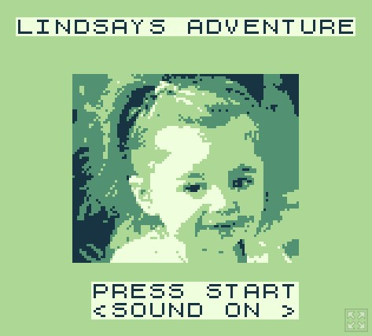

# README
This is a Gameboy game I made for my daughter Lindsay to help spark her interest in Video Games. You play as baby Lindsay on an epic adventure to save her favorite doll. It runs on an actual Gameboy if you download the rom.

I worked on this project on and off for several years. Started with GBDK and later upgraded to GBDK 2020. I wanted to share it on the web for all to enjoy. Source Code will be uploaded to GitHub. I also have a version that fits into 32kb with no mapper but is more limited and does not have music. The version on this site is the full version that is 128kb and uses bank switching to accommodate the additional content. 

You can play it on https://nbarkhina.itch.io/lindsay

# Build
On windows to build it from source install GBDK 2020 and run the compile.bat script. If you're on Linux just run these

`wget -O gbdk-linux64.tar.gz "https://github.com/gbdk-2020/gbdk-2020/releases/download/4.5.0/gbdk-linux64.tar.gz" && mkdir -p gbdk && tar -xzf gbdk-linux64.tar.gz -C gbdk --strip-components=1 && ls -la gbdk | sed -n '1,120p'`

Then

`./gbdk/bin/lcc -Wa-l -Wl-m -Wl-j -Wl-yt0x19 -Wl-yo8 -o lindsay.gb main.c levels_bank.c gfx_bank.c music_bank.c engine_bank.c boss_bank.c`